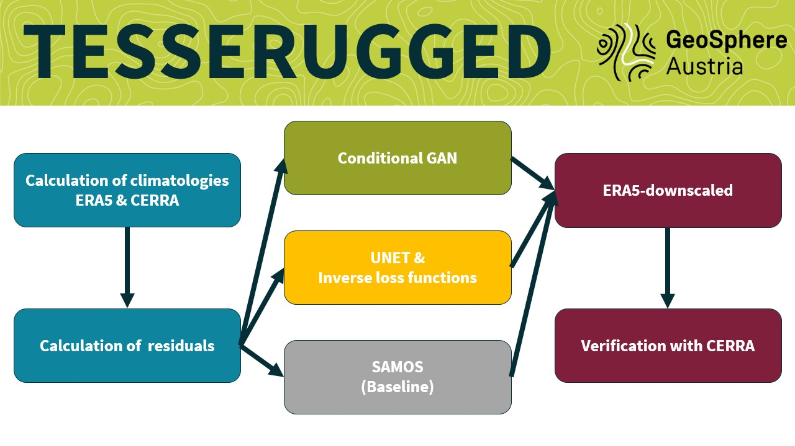

# Tesserugged

Downscaling ERA5 using machine learning techniques

## Workflow

## Project team

[Irene Schicker](https://github.com/ischicker),
[Markus Dabernig](https://github.com/mdaber),
[Toni Jurlina](https://github.com/tjurlina),
[Alexander Kann](https://github.com/alexanderkann),
[Sebastian Lehner](https://github.com/seblehner),
[Konrad Mayer](https://github.com/konradmayer),
[Petrina Papazek](https://github.com/petrinap),
[Matthias Schlögl](https://github.com/r3xth0r)

## Mentors

[Mariana Clare](https://github.com/mc4117),
[Matthew Chantry](https://github.com/mchantry),
[Andras Horanyi](https://github.com/HoranyiAndras),
[Cornel Soci](https://github.com/cornelsoci)